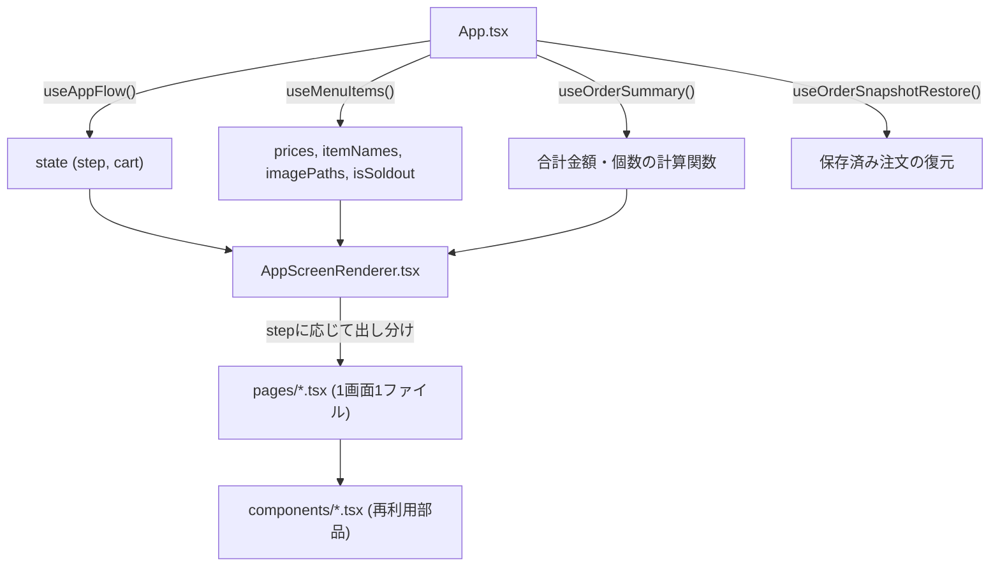
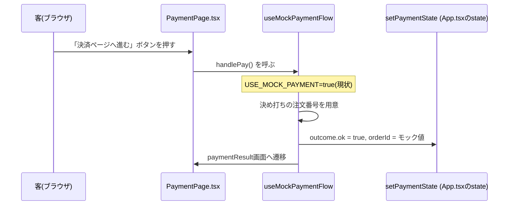

# フロントエンド仕様書(後任フロントエンド開発者向け)

作成日: 2026-08-30
作成者: 前任フロントエンド担当・伊知川滉太

## 1. このドキュメントについて

このアプリ(`School-Festival-2`)を初めて引き継ぐ方向けに、**アプリの概要・設計・重要な変数・「どこを直せば何が変わるか」**をまとめたものです。エンジニアとして駆け出しの方でも読み進められるよう、必要に応じて基礎的な説明も入れています。

**このドキュメントが扱わないこと**: 「今回の改修で何が変わったか」という変更履歴は扱いません。それは [docs/ver2.0-changes.md](./ver2.0-changes.md) にまとめてあります。バックエンドへの依頼事項は [docs/backend-requirements.md](./backend-requirements.md)、セットアップ手順や環境変数の一覧は [README.md](../README.md) を参照してください。このドキュメントは、それらを読んだ上で「じゃあ実際どこをどう触ればいいのか」を知るためのものです。

**特に、後任の方はPaySys経由の決済実装を予定されているとのことなので、セクション8にその内容を重点的にまとめました。** まずセクション2〜7で全体像をつかんでから、セクション8を読むことをおすすめします。

---

## 2. アプリの概要

学祭の屋台(角煮料理)向けの、客側モバイル注文アプリです。客がスマホのブラウザでアクセスし、商品選択→予約時刻の指定→決済→番号札の確認、という流れで注文を完了させます。

```
タイトル → メニュー選択 → ドリンク選択 → カート確認 → 予約時刻選択
  → 決済方法選択(カード/PayPay) → 決済画面 → 決済結果 → 番号札表示
```

- バックエンド(APIサーバー)は**別リポジトリ**(`Shrssss/CDMTs-payment-application`)で、別の担当者が開発しています。**このリポジトリはフロントエンドのみを扱います。バックエンドのコードは直接変更せず**、必要な変更は[docs/backend-requirements.md](./backend-requirements.md)に依頼事項として書く運用です。この運用は引き続き踏襲することを推奨します。
- 技術スタック: React 19 + TypeScript + Vite。テストはJest。詳細はセクション9参照。

---

## 3. 全体アーキテクチャ

### 3-1. ディレクトリ構成の考え方

```
src/
├── App.tsx                 # ルートコンポーネント。状態管理フックを呼び出し、画面全体を組み立てる
├── AppScreenRenderer.tsx   # 現在のステップに応じてページを出し分ける
├── pages/                  # 画面単位のコンポーネント(1画面 = 1ファイル)
├── components/             # 複数の画面で使い回す部品(ボタン、カード等)
├── hooks/                  # 状態管理・副作用を担うReactフック
├── features/               # 業務ロジック(画面を持たない、純粋な計算・変換処理)
│   ├── order/               # カート・注文まわり
│   ├── payment/              # 決済まわり
│   ├── reservation/          # 予約時刻まわり
│   └── soldout/               # 売り切れ判定まわり
├── services/                # バックエンドAPIとの通信(apiService.ts 1ファイルのみ)
├── constants/               # 定数・設定値・型に近い静的データ
├── utils/                   # 汎用のユーティリティ関数(日付処理等)
├── types.ts                 # アプリ全体で共有する型定義
└── legacy/square/            # ⚠️ 未使用。旧Square決済コードの保管庫(触らなくてよい)
```

**層の依存の向き**: `pages` → `hooks`/`components` → `features`/`services`/`utils` → `constants`/`types`、という一方向を意識しています。逆方向(例: `constants`が`features`をimportする)は基本的にありません。新しいコードを書くときもこの向きを崩さないようにしてください。

### 3-2. データの流れ(状態管理)



`App.tsx`が状態管理フック(`useAppFlow`等)を呼び出し、結果をpropsとして`AppScreenRenderer.tsx`→各`pages/`コンポーネントへ渡していきます。Reduxのような外部の状態管理ライブラリは使っていません。React標準の`useReducer`/`useState`で足りる規模だと判断した設計です。

> **豆知識(Reactの`useReducer`とは)**: 「今の状態」と「何が起きたか(アクション)」を受け取って「次の状態」を返す関数(この場合は[`screenState`](../src/hooks/useAppFlow.ts))を1つ書いておくと、Reactがその関数を使って状態を管理してくれる仕組みです。`dispatch({type: "NEXT"})`のように「何が起きたか」を送ると、`screenState`関数が次の状態を計算してくれます。Reduxの考え方をReact標準機能だけで実現したもの、とイメージすると分かりやすいです。

---

## 4. 画面遷移の仕組み

[`src/hooks/useAppFlow.ts`](../src/hooks/useAppFlow.ts)が画面遷移とカート状態を管理しています。

### 4-1. `Step`型と画面の順序

[`src/constants/steps.ts`](../src/constants/steps.ts)の`STEPS`定数が全画面の名前を定義し、`STEPS_ARRAY`(`Object.values(STEPS)`)の**並び順がそのまま画面遷移の順序**になります。

```ts
STEPS_ARRAY = ["title", "menu", "drink", "cart", "time",
  "paymentMethod", "payment", "paymentPaypay", "paymentResult", "numberTag"]
```

`dispatch({type: "NEXT"})`は配列のインデックスを1つ進めるだけ、`PREV`は1つ戻すだけです。**画面を追加・入れ替えたい場合は、基本的にこの配列の順序を変えるだけで対応できます**(表示するページ自体は[`AppScreenRenderer.tsx`](../src/AppScreenRenderer.tsx)に追加が必要、セクション7参照)。

### 4-2. `AppState`(画面全体の状態)

```ts
interface AppState {
  step: Step;   // 今どの画面にいるか
  cart: Cart;   // カートの中身(後述)
}
```

### 4-3. フッター(次へ/戻るボタン)の表示・無効化ルール

どの画面でフッターを出すか、次へボタンを無効化する条件、ボタンの文言は、[`src/constants/stepRules.ts`](../src/constants/stepRules.ts)の`STEP_RULES`という1つのオブジェクトに集約しています。画面ごとの判定ロジックを`Footer.tsx`や各ページに書き散らさず、ここ一箇所を見れば全ステップのルールが分かるようにしているのが設計意図です。**フッターの挙動を変えたいときは、まずここを見てください。**

### 4-4. 予約時刻(`selectedTime`)

`useAppFlow`の外側、`App.tsx`で別の`useState`として管理しています(`AppState`には含まれません)。予約時刻は`time`画面でしか変わらず、カートとライフサイクルが違うための意図的な分離です。値は`"HH:mm"`形式の文字列、または(localStorageから復元した場合は)ISO形式の文字列です。

---

## 5. カートの仕組み(商品ID・ドリンクID)

### 5-1. `Cart`型

```ts
type Cart = Record<number, number>;  // 商品ID/ドリンク種別ID → 個数
```

商品もドリンクも、すべて「IDをキーとした個数マップ」というシンプルな1つの型で表現されています。

### 5-2. 商品ID一覧([`src/constants/items.ts`](../src/constants/items.ts)の`PRODUCT_CATEGORIES`)

| 定数名 | ID | 内容 |
|---|---|---|
| `PORK_SINGLE` | 10 | 角煮 単品 |
| `PORK_SINGLE_LARGE` | 20 | 角煮大盛り 単品 |
| `DRINK_SINGLE` | 30 | ドリンク単品(セットに属さない) |
| `PORK_DRINK_SET` | 40 | 角煮ドリンクセット |
| `PORK_DRINK_SET_LARGE` | 50 | 角煮ドリンクセット大盛り |
| `COLA` | 91 | コーラ(ドリンク種別) |
| `ORANGE` | 92 | なっちゃんオレンジ(ドリンク種別) |
| `CIDER` | 93 | 三ツ矢サイダー(ドリンク種別) |
| `OOLONG` | 94 | 烏龍茶(ドリンク種別) |

**商品IDを扱うときは、必ずこの`PRODUCT_CATEGORIES`定数経由で参照してください**(`40`のような生の数字を直接コードに書かない)。IDを新しく追加・変更する場合の影響範囲が把握しやすくなります。

### 5-3. 商品IDとドリンクIDは「組み合わせない」

**重要な設計判断**です。「セット40個のうちコーラが1個、オレンジが1個」というような**紐付け計算は一切行いません**。カートは常に「商品カテゴリごとの個数」と「ドリンク種類ごとの合計数」を、独立した2種類の数量として持つだけです。

- 送信データの組み立ては[`src/utils/orderUtils.ts`](../src/utils/orderUtils.ts)の`buildOrderItems()`が担当し、`{items: [{itemId, quantity}], drinkCounts: {drinkId: count}}`という形にします。
- 「どのセットにどのドリンクが入っているか」を決める計算は、**バックエンド側で行う方針**です(現状バックエンド未対応。[docs/backend-requirements.md](./backend-requirements.md) 5番参照)。
- (経緯: 以前はフロント側でセットID+ドリンクIDを合成した架空のIDを作って送っていましたが、バックエンドの商品登録の仕組みと相性が悪く、注文失敗の原因になっていました。詳細は[docs/ver2.0-changes.md](./ver2.0-changes.md)参照)

### 5-4. 新しい商品カテゴリを追加する場合

1. `items.ts`の`PRODUCT_CATEGORIES`/`PRODUCT_CATEGORY_IDS`/`CART_INITIAL`に追加
2. [`src/pages/MenuPage.tsx`](../src/pages/MenuPage.tsx)に表示用の`<Menu>`コンポーネントを追加
3. バックエンドの商品マスタへ登録を依頼
4. ドリンク種別を増やす場合は`DRINK_TYPE_IDS`と[`src/pages/DrinkPage.tsx`](../src/pages/DrinkPage.tsx)も同様に

---

## 6. 重要な定数・設定値一覧

すべて[`src/constants/config.ts`](../src/constants/config.ts)にあります。

| 定数 | 内容 |
|---|---|
| `API_ENDPOINTS` | バックエンドAPIのパス一覧 |
| `RESERVATION_CONFIG` | 予約受付の開始オフセット・最終受付時刻(17:10)・時刻の刻み幅 |
| `ORDER_SNAPSHOT_CONFIG` | localStorageに保存する注文情報のキー名・有効期限(1時間) |
| `USE_MOCK_PAYMENT` | ⚠️ 決済のモックスイッチ。詳細はセクション8 |
| `USE_MOCK_MENU` | メニュー(価格・商品名・画像)のモックスイッチ |
| `USE_TEST_TIME` | テスト用の固定時刻を使うかどうかのスイッチ |
| `TIMEOUTS` / `RETRY_CONFIG` / `SQUARE_*` | ⚠️ 未使用(Square廃止に伴い隔離。触らなくてよい) |

**3つのモックスイッチ(`USE_MOCK_PAYMENT`/`USE_MOCK_MENU`/`USE_TEST_TIME`)は、環境変数(`.env.local`/`.env.production`の`VITE_USE_MOCK_*`)が未設定だと`true`(モックオン)になります。** 本番公開前に`.env.production`で明示的に`false`にすることを必ず確認してください。

---

## 7. 画面(ページ)一覧

| ステップ名 | ファイル | 内容 |
|---|---|---|
| `title` | [`pages/TitlePage.tsx`](../src/pages/TitlePage.tsx) | タイトル画面 |
| `menu` | [`pages/MenuPage.tsx`](../src/pages/MenuPage.tsx) | 商品選択 |
| `drink` | [`pages/DrinkPage.tsx`](../src/pages/DrinkPage.tsx) | ドリンク選択 |
| `cart` | [`pages/CartPage.tsx`](../src/pages/CartPage.tsx) | カート確認 |
| `time` | [`pages/TimePage.tsx`](../src/pages/TimePage.tsx) | 予約時刻選択 |
| `paymentMethod` | [`pages/PaymentMethodPage.tsx`](../src/pages/PaymentMethodPage.tsx) | 決済方法選択 |
| `payment` | [`pages/PaymentPage.tsx`](../src/pages/PaymentPage.tsx) | カード決済画面 |
| `paymentPaypay` | [`pages/PaymentPayPayPage.tsx`](../src/pages/PaymentPayPayPage.tsx) | PayPay決済画面 |
| `paymentResult` | [`pages/PaymentResultPage.tsx`](../src/pages/PaymentResultPage.tsx) | 決済結果 |
| `numberTag` | [`pages/NumberTagPage.tsx`](../src/pages/NumberTagPage.tsx) | 番号札表示 |

どのステップでどのページを描画するかは[`src/AppScreenRenderer.tsx`](../src/AppScreenRenderer.tsx)の`renderPage()`関数(switch文)で決まります。**新しい画面を追加する場合は、(1)`steps.ts`の`STEPS`に追加、(2)`pages/`に新しいファイルを作成、(3)`AppScreenRenderer.tsx`のswitch文に分岐を追加、(4)必要なら`stepRules.ts`にフッターのルールを追加、の4点セットです。**

---

## 8. PaySys決済の実装ガイド(最重要)

このセクションは、後任の方が着手される**PaySys経由の決済実装**のために、特に詳しく書いています。

### 8-1. 現状の全体像



**現状、実際のバックエンドへの通信は一切発生していません。** ボタンを押すと、決め打ちの注文番号(例: `PAYSYS-CARD-MOCK-ORDER`)で即座に「成功」扱いになり、次の画面に進むだけの**見せかけの動作**です。

後任の方が実装するのは、この`H`(決済フック)の中身を、**実際にバックエンドと通信して注文を作成し、決済を実行する処理**に置き換える作業です。

### 8-2. 関係するファイル

| ファイル | 役割 |
|---|---|
| [`src/pages/PaymentPage.tsx`](../src/pages/PaymentPage.tsx) | カード決済のボタンを表示する画面。内部で`useCardPaymentFlow`を呼ぶ |
| [`src/pages/PaymentPayPayPage.tsx`](../src/pages/PaymentPayPayPage.tsx) | PayPay決済の画面。内部で`usePayPayPaymentFlow`を呼ぶ |
| [`src/hooks/useCardPaymentFlow.ts`](../src/hooks/useCardPaymentFlow.ts) | カード決済用の薄いラッパー(下記`useMockPaymentFlow`にカード固有の値を渡すだけ) |
| [`src/hooks/usePayPayPaymentFlow.ts`](../src/hooks/usePayPayPaymentFlow.ts) | PayPay決済用の薄いラッパー(同上) |
| [`src/hooks/useMockPaymentFlow.ts`](../src/hooks/useMockPaymentFlow.ts) | **実装の中心となるファイル。今はモックのみ実装されている** |
| [`src/features/payment/paymentSession.ts`](../src/features/payment/paymentSession.ts) | 「注文作成→決済」の骨組み。**現状どこからも呼ばれていないが、実装の出発点として使うことを想定して用意してある** |
| [`src/services/apiService.ts`](../src/services/apiService.ts) | バックエンドAPIとの通信をまとめるファイル。`Api.createOrder()`は実装済み |
| [`src/constants/mocks/paysysCardMock.ts`](../src/constants/mocks/paysysCardMock.ts) / [`paypayPaymentMock.ts`](../src/constants/mocks/paypayPaymentMock.ts) | モック用の決め打ち注文番号 |

> **豆知識(フックとは)**: `useXxx`という名前の関数は「フック」と呼ばれ、Reactコンポーネントの中で状態(`useState`)や副作用(`useEffect`)を扱うための仕組みです。`useMockPaymentFlow`のようにアプリ側で定義した「自作フック」は、複数のコンポーネントで使い回したいロジック(ここでは決済処理)をひとまとめにする入れ物として使われます。

### 8-3. 実装の進め方(ステップバイステップ)

1. **バックエンド担当者とAPI契約を合意する**。エンドポイント名、リクエスト・レスポンスの形を[docs/backend-requirements.md](./backend-requirements.md)を出発点に相談してください。特にPayPayは現状バックエンド側の決済実行APIが存在しません。
2. **`useMockPaymentFlow.ts`の`else`分岐(`USE_MOCK_PAYMENT`がオフの場合)を実装します。** 今は「未実装です」というエラーを返すだけになっている箇所です。ここに実際のAPI呼び出しを書きます。
3. その際、**[`src/features/payment/paymentSession.ts`](../src/features/payment/paymentSession.ts)の`createPaymentOrder()`を土台として使ってください。** このロジックには、決済手段に関わらず必要な「カートを送信用データに変換する」「予約時刻を検証する」「合計金額を計算する」処理と、下記8-4で説明する重要な設計原則がすでに組み込まれています。
4. カード決済(`useCardPaymentFlow.ts`)とPayPay決済(`usePayPayPaymentFlow.ts`)は、どちらも同じ`useMockPaymentFlow.ts`を経由しているため、**1箇所直せば両方に反映されます**。ただし決済の実行方法自体(カード情報の入力・トークン化の方式、PayPayのリダイレクト方式等)は決済手段ごとに異なるはずなので、必要に応じて`useMockPaymentFlow`のパラメータを増やす、または決済手段ごとの実行部分だけを分離する、といった設計変更が必要になる可能性があります。
5. 動作確認: `VITE_USE_MOCK_PAYMENT=false`を`.env.local`に設定し、実際にバックエンドと通信することを確認してください(バックエンドをローカルで起動しておく必要があります)。

### 8-4. 絶対に守ってほしい設計原則

**(1) 注文の作成は「実際に課金する直前」に行う。**

これは過去に実際に踏んだ失敗を踏まえた、最も重要な原則です。

- ❌ **やってはいけない例**: 決済画面を開いた瞬間(`useEffect`等)に注文を作成する。
  - → カートに戻ってもう一度決済画面を開くと、注文が2件作られる
  - → 決済の途中でページを再読み込みすると、作成済みの注文がアプリから見えなくなり「宙に浮いた注文」になる
- ✅ **正しい例**: カード情報のトークン化が成功した直後など、**「これから確実に課金する」というタイミングの直前**に注文を作成する。`paymentSession.ts`の`createPaymentOrder()`はこの設計で書かれています。

**(2) 金額はフロント側で再計算しない。サーバーが返した金額をそのまま使う。**

カート確認画面での金額表示は`useOrderSummary.ts`の`calculateSumPrice()`で計算していますが、これは**表示用**です。実際に決済に使う金額は、注文作成APIのレスポンスに含まれる金額をそのまま使ってください。フロント側の計算とバックエンド側の計算がズレた場合に金額が食い違う事故を防ぐためです(この原則は[docs/backend-requirements.md](./backend-requirements.md) 7番でバックエンド側にも依頼済みです)。

**(3) バックエンドが返すエラーを握りつぶさない。**

`apiService.ts`の各メソッド(`createOrder`等)は、失敗時に日本語のエラーメッセージ付きで例外を投げるようにしてあります。`try/catch`で握りつぶしてモック成功のように振る舞わせる、といった実装は絶対にしないでください(このアプリ全体の方針として、「実装していないなら実装していないと明示する」「失敗したら失敗したと表示する」を徹底しています)。

**(4) `USE_MOCK_PAYMENT`の分岐は残しておく。**

開発中・動作確認中にバックエンドなしで画面遷移を試せる、既存のモック分岐(`if (USE_MOCK_PAYMENT) {...}`)は消さずに残してください。今後も開発時の動作確認に使えます。

### 8-5. バックエンドとの通信の実例

`Api.createOrder()`(実装済み)を例に、実際のリクエスト・レスポンスの形を示します。

**リクエスト**(`POST /api/orders/set`):
```json
{
  "orderDate": "2026-08-30T12:00:00",
  "reservedTime": "2026-08-30T12:30:00",
  "items": [{ "itemId": 10, "quantity": 1 }, { "itemId": 40, "quantity": 2 }],
  "drinkCounts": { "91": 1, "92": 1 },
  "servingStatus": 0,
  "paymentStatus": false
}
```

**レスポンス**: 素の数値(注文ID)がそのまま返ります。例: `42`

決済実行API(`chargeOrder`相当)は、Square用の実装が[`src/legacy/square/`](../src/legacy/square/)に参考として残っています(そのままは使えません。PaySys用のAPI契約はバックエンド担当者と別途合意が必要です)が、リクエスト/レスポンスの受け渡し方の実装パターンとしては参考になります。

### 8-6. よくある落とし穴

- **`USE_MOCK_PAYMENT`はビルド時に固定される値です**(`import.meta.env`経由で読むため)。`.env.local`を変更したら、開発サーバー(`npm run dev`)を再起動してください。
- **PayPayは現状バックエンドの決済実行APIが存在しません。** カードより先にバックエンドとの合意が必要です。
- [`src/pages/PaymentResultPage.tsx`](../src/pages/PaymentResultPage.tsx)には、失敗時に`outcome.orderId`があれば予約時刻を表示する分岐がありますが、**現状のモック実装ではこの状態(`ok: false`かつ`orderId`が非null)には一度も到達しません**(未実装エラーは常に`orderId: null`で返るため)。これは「注文は作成できたが、その後の課金が失敗した」というPaySys実装後に実際に起こりうる状態を見越した分岐です。`createPaymentOrder()`のように**注文作成と課金を分離して実装した場合、課金失敗時のエラーハンドリングで`orderId`を正しく`outcome`に渡すようにしてください**(そうしないと、せっかくのこの表示分岐が実装後も到達しないままになります)。
- テストを書く際、`USE_MOCK_PAYMENT`は`process.env.VITE_USE_MOCK_PAYMENT`をセットしてから`jest.resetModules()`+`require()`し直す必要があります(セクション9参照)。

---

## 9. テストの書き方

- `npx jest`で全テスト実行。個別実行は`npx jest <ファイル名の一部>`。
- `npm run lint`でESLintを実行できます。
- 環境変数(`USE_MOCK_PAYMENT`等)によって挙動が変わる関数・フックをテストする場合、**`jest.resetModules()`してから`require()`し直す**パターンを使っています(例: [`src/__tests__/useMockPaymentFlow.test.js`](../src/__tests__/useMockPaymentFlow.test.js))。理由: これらの値は`import.meta.env`から**モジュール読み込み時に一度だけ**計算されるため、テストごとに違う値を試すにはモジュールを読み直す必要があるからです。このパターンでReactコンポーネントをレンダリングする場合、`react`/`react-dom/client`も`jest.resetModules()`の後に**改めて`require()`し直してください**(そうしないとモジュールインスタンスの不一致で`useState`が壊れます)。
- コンポーネントのレンダリングテストは、`react-dom/client`の`createRoot`+`act`を素朴に使うパターンです(テストライブラリ`@testing-library/react`等は導入していません)。既存のテストファイル(例: [`src/__tests__/Menu.test.js`](../src/__tests__/Menu.test.js))を参考にしてください。
- `src/legacy/square/__tests__/`配下は、廃止済みのSquare関連コード専用のテストです。新しいAPIメソッドを追加した際は、実運用のテスト([`src/__tests__/apiService.test.js`](../src/__tests__/apiService.test.js))と廃止済みコードのテストを混在させないよう注意してください。

---

## 10. 開発環境・ビルドツール

React 19 + TypeScript + Vite構成です。

```bash
npm ci        # 依存関係のインストール
npm run dev   # 開発サーバー起動(または npm start)
npm run build # 型チェック(tsc) + 本番ビルド(vite build)
npm run lint  # ESLint
npx jest      # テスト
```

- テストはVitestではなく**Jestのまま**です(既存テストの`jest.resetModules()`パターンを維持するため、あえて変更していません)。
- `src/legacy/square/`はTypeScript移行の対象外で`.js`/`.jsx`のままです。**触る必要はありません。**
- push/PR時に`.github/workflows/ci.yml`が自動でlint→test→buildを実行します。

---

## 11. 既知の懸念事項(簡潔なまとめ)

詳細は[docs/backend-requirements.md](./backend-requirements.md)(バックエンド側の未対応事項一覧)を参照してください。特に重要なもの:

1. **PaySysの実装そのものが未着手**(セクション8参照、最優先)
2. `updatePaymentStatus`/`createPayment`のIDOR脆弱性(バックエンド側対応待ち)
3. ドリンク割り振りロジックのバックエンド実装が未着手
4. 注文照会用トークンAPIが未実装(現状localStorageで暫定対応。詳細は[docs/ver2.0-changes.md](./ver2.0-changes.md)参照)
5. 予約時刻の営業時間内チェックがフロントのみ

**本番公開前には、必ず`.env.production`の3つのモックスイッチが全て`false`になっていることを確認してください。**
